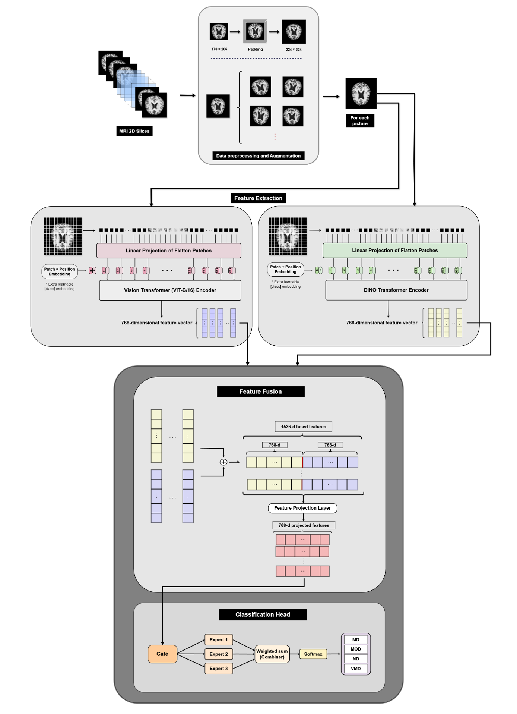
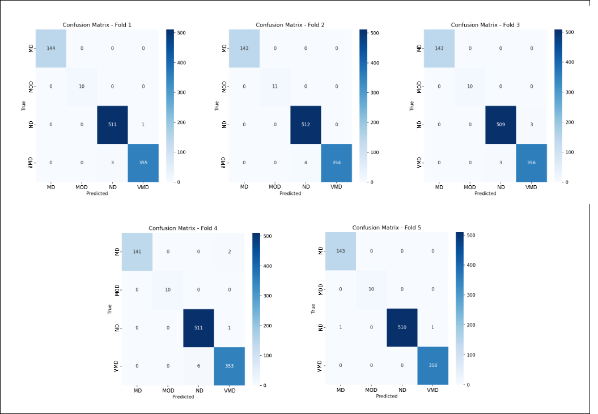
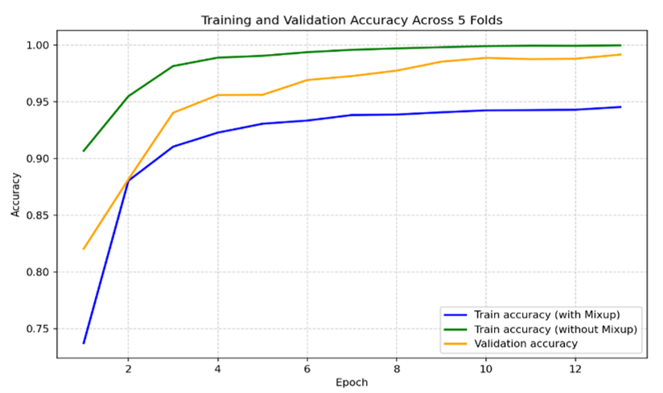
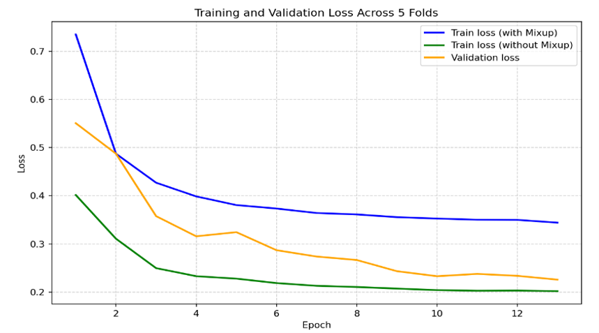
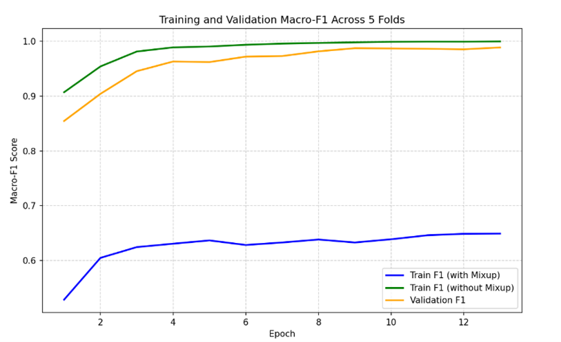
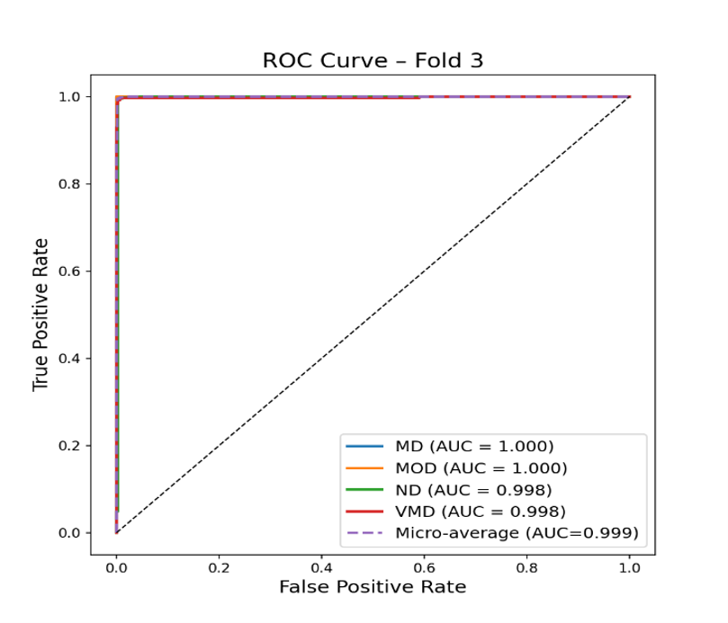

# Alzheimer's Disease Stage Classification using DINO Vision Transformer and Mixture-of-Experts

> **Official implementation of the accompanying research paper**
> 
> **Authors:** Vida Sadati, Behnam Mohammad Hasani Zade, Najme Mansouri
> 
> **Affiliation:** Department of Computer Science, Shahid Bahonar University of Kerman, Kerman, Iran
> 
> **Corresponding author:** Vida Sadati (vidasadati@gmail.com)


[]()
[]()
[]()

A PyTorch implementation for Alzheimer's disease stage classification from brain MRI images using a **DINO Vision Transformer (ViT)** backbone and a **Mixture-of-Experts (MoE)** classifier.

The framework performs **5-Fold Stratified Cross Validation**, evaluates the best checkpoint from each fold on an independent held-out test set, and automatically generates publication-quality evaluation figures.

---

# Highlights

- End-to-end Alzheimer's disease stage classification framework
- Self-supervised DINO Vision Transformer backbone
- Mixture-of-Experts (MoE) classification head
- Robust evaluation using 5-Fold Stratified Cross Validation
- Independent held-out test set evaluation
- Publication-ready visualization and analysis scripts
- Fully reproducible PyTorch implementation


---

# Workflow

<p align="center">

</p>


---

# Features

- DINO Vision Transformer backbone
- Mixture-of-Experts (MoE) classifier
- Mixup augmentation
- Label Smoothing
- AdamW + Lookahead optimizer
- Cosine Annealing Warm Restarts
- Early Stopping
- 5-Fold Stratified Cross Validation
- Independent held-out test evaluation
- Automatic ROC, Accuracy, Loss and F1-score plots


---

# Pipeline

```
Raw Dataset
      │
      ▼
preprocessing.py
      │
      ▼
Processed Dataset
      │
      ▼
train.py
(5-Fold Cross Validation)
      │
      ├── Best Models
      ├── Logs
      ├── Predictions
      └── Confusion Matrices
      │
      ▼
test.py
      │
      ▼
Performance Evaluation
      │
      ▼
Plot Scripts
```

---

# Project Structure

```
.
├── preprocessing.py
├── train.py
├── test.py
├── configs.py
├── models.py
├── dataset.py
├── dataloader.py
├── utils.py
│
├── plots/
│   ├── plot_accuracy.py
│   ├── plot_loss.py
│   ├── plot_f1.py
│   └── plot_roc.py
│
├── raw_dataset/
├── input/
├── output/
└── images/
```

---
# Dataset

This project uses the **OriginalDataset** from the publicly available **Augmented Alzheimer MRI Dataset** available on Kaggle.

Dataset:
https://www.kaggle.com/datasets/uraninjo/augmented-alzheimer-mri-dataset?select=OriginalDataset

The original dataset contains four classes:

- NonDemented
- VeryMildDemented
- MildDemented
- ModerateDemented

Only the **OriginalDataset** was used in this work. The `preprocessing.py` script automatically preprocesses the images, preserves the aspect ratio using centered padding, resizes them to **224×224**, and creates the train/test split.

> **Note:** The dataset is **not included** in this repository due to licensing and size limitations. Please download it from Kaggle and place it inside the `raw_dataset/` directory before running `preprocessing.py`.

---

# Usage

### 1. Prepare the dataset

Organize the MRI dataset as

```
raw_dataset/
├── MildDemented/
├── ModerateDemented/
├── NonDemented/
└── VeryMildDemented/
```

Run

```bash
python preprocessing.py
```

This script

- converts images to RGB
- preserves aspect ratio
- applies centered zero padding
- resizes images to **224×224**
- creates an **80/20 train-test split**

---

### 2. Train the model

```bash
python train.py
```

Training automatically performs

- 5-Fold Stratified Cross Validation
- Mixup augmentation
- Label Smoothing
- Mixed Precision Training
- Early Stopping
- Best model checkpointing

---

### 3. Evaluate

```bash
python test.py
```

The evaluation reports

- Accuracy
- Macro F1-score
- Classification Report
- Confusion Matrix
- Mean performance across folds

---

### 4. Generate Figures

```bash
python plot/plot_accuracy.py
python plot/plot_loss.py
python plot/plot_f1.py
python plot/plot_roc.py
```

---

# Cross-Validation Performance

| Fold | Accuracy |
|------|---------:|
| Fold 1 | 99.61% |
| Fold 2 | 99.61% |
| Fold 3 | 99.41% |
| Fold 4 | 99.12% |
| Fold 5 | **99.80%** |


---

# Independent Test Performance

| Metric | Value |
|--------|------:|
| Accuracy | **99.49%** |
| Macro Precision | 0.994 |
| Macro Recall | 0.997 |
| Macro F1-score | 0.995 |


---

## Confusion Matrices (5-Fold Cross Validation)

<p align="center">

</p>

---

# Learning Curves

## Accuracy

<p align="center">

</p>

## Loss

<p align="center">

</p>

## F1-score

<p align="center">

</p>

## ROC Curve

<p align="center">

</p>

---

# Output

```
output/
├── best_dinovit_moe_fold*.pth
├── checkpoint_fold*.pth
├── summary_fold*.csv
├── logsDINO/
├── confusionsDINO/
├── val_listsDINO/
├── y_true_fold*.npy
├── y_pred_fold*.npy
├── y_prob_fold*.npy
└── test_results/
```

---

# Paper

This repository contains the official implementation of the paper

**A Hybrid DINO–ViT–MoE Framework for Multi-Stage Alzheimer's Disease Classification from MRI Images**

The manuscript is currently under review. The paper will be made publicly available after publication.

---

# License

This project is released under the MIT License.
